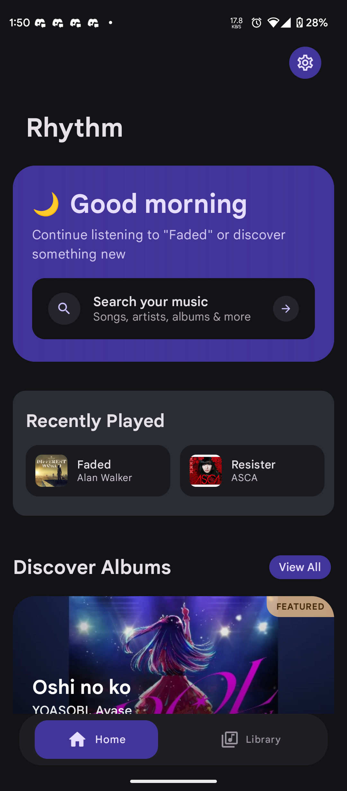
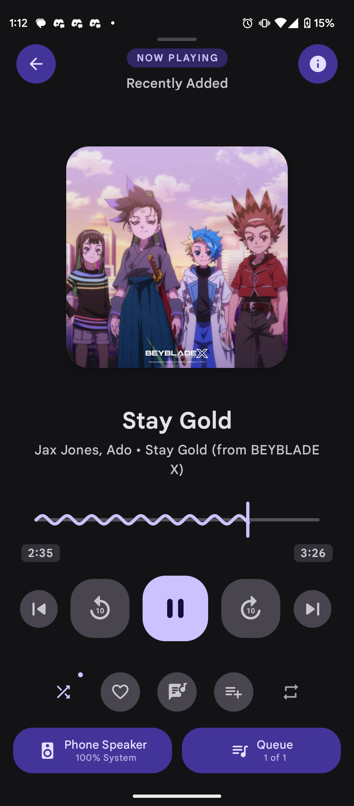
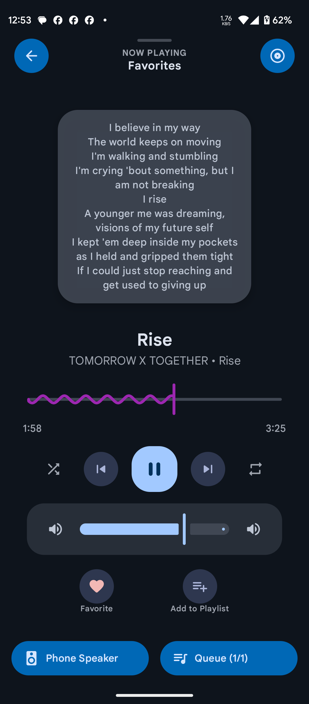
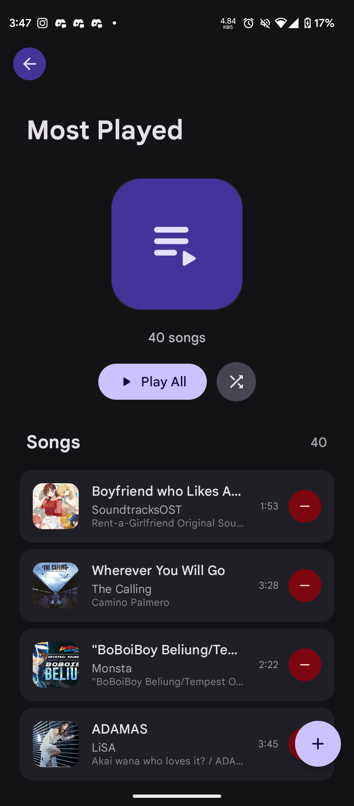
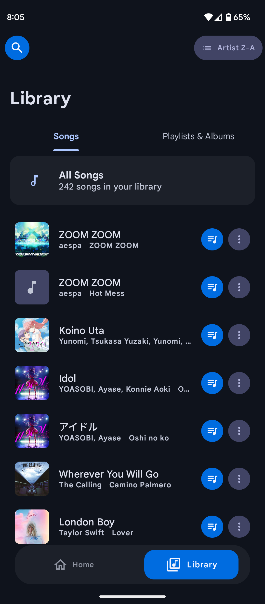
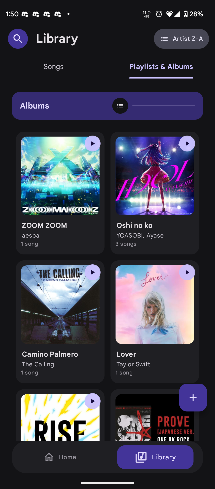
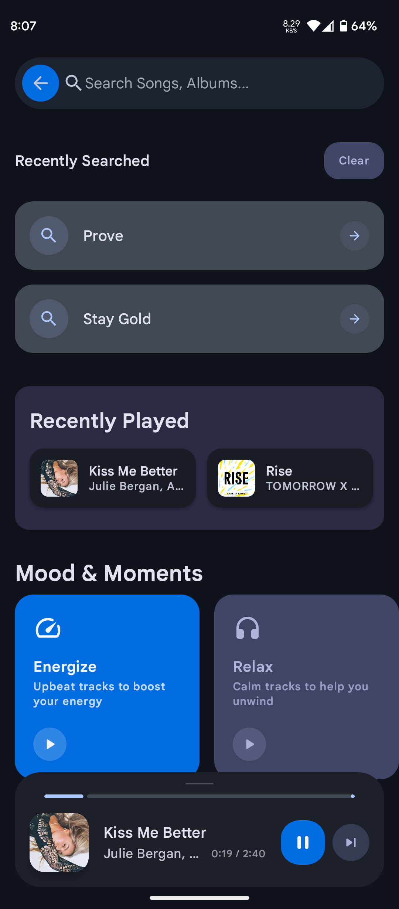
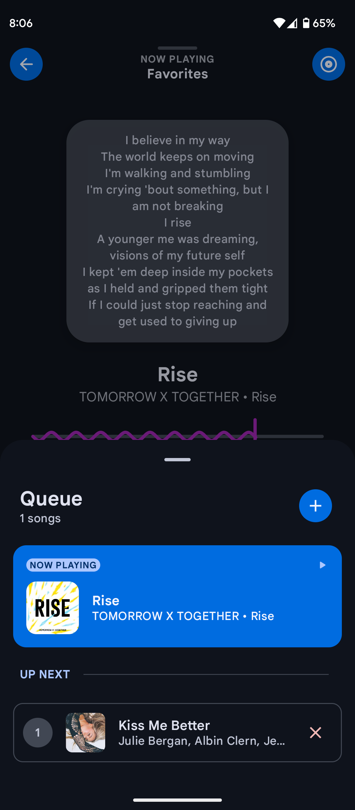
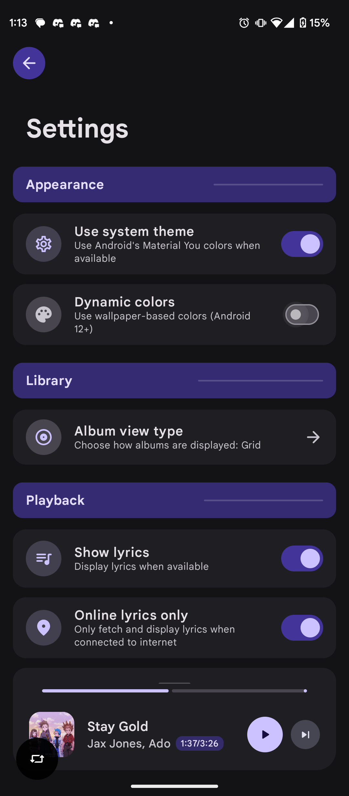

# Rhythm - Offline Android Music App

<div align="center">
  
</div>

## Overview
Rhythm is a premium music player for Android that delivers a seamless audio experience with a beautiful Material You design. Enjoy your music collection with advanced playback features, intuitive controls, and comprehensive audio format support.

## Screenshots

<div align="center">
  <style>
    .screenshot-grid {
      display: grid;
      grid-template-columns: repeat(auto-fill, minmax(180px, 1fr));
      gap: 16px;
      margin: 24px 0;
      padding: 0 16px;
    }
    .screenshot-card {
      background: #1e1e1e;
      border-radius: 12px;
      overflow: hidden;
      box-shadow: 0 4px 8px rgba(0, 0, 0, 0.2);
      transition: transform 0.2s, box-shadow 0.2s;
    }
    .screenshot-card:hover {
      transform: translateY(-4px);
      box-shadow: 0 8px 16px rgba(0, 0, 0, 0.3);
    }
    .screenshot-img {
      width: 100%;
      height: 320px;
      object-fit: cover;
      border-bottom: 1px solid #333;
    }
    .screenshot-caption {
      padding: 12px;
      text-align: center;
      font-size: 14px;
      color: #e0e0e0;
      background: #252525;
    }
    @media (max-width: 768px) {
      .screenshot-grid {
        grid-template-columns: repeat(2, 1fr);
      }
    }
    @media (max-width: 480px) {
      .screenshot-grid {
        grid-template-columns: 1fr;
      }
    }
  </style>

  <div class="screenshot-grid">
    <div class="screenshot-card">
      
      <div class="screenshot-caption">🎵 Home Screen</div>
    </div>
    <div class="screenshot-card">
      
      <div class="screenshot-caption">▶️ Now Playing</div>
    </div>
    <div class="screenshot-card">
      
      <div class="screenshot-caption">📝 Lyrics View</div>
    </div>
    <div class="screenshot-card">
      
      <div class="screenshot-caption">🎼 Playlist View</div>
    </div>
    <div class="screenshot-card">
      
      <div class="screenshot-caption">🎧 Songs Library</div>
    </div>
    <div class="screenshot-card">
      
      <div class="screenshot-caption">💿 Albums View</div>
    </div>
    <div class="screenshot-card">
      
      <div class="screenshot-caption">🔍 Search</div>
    </div>
    <div class="screenshot-card">
      
      <div class="screenshot-caption">⏭️ Queue Management</div>
    </div>
    <div class="screenshot-card">
      
      <div class="screenshot-caption">⚙️ Settings</div>
    </div>
  </div>
</div>

## Features

- 🎨 **Modern UI**: Built with Jetpack Compose and Material 3 design
- 🎵 **Comprehensive Audio Support**: Plays various formats including MP3, AAC, FLAC, OGG, WAV
- 📱 **Android Support**: Targets Android API 34 with compatibility down to Android 8.0
- 🎯 **Media3 Integration**: Robust media playback using ExoPlayer
- 📂 **Advanced Playlist Management**: Create, edit, and organize playlists
- 🔄 **Background Playback**: Continuous playback with foreground service
- 🎨 **Dynamic Theming**: Material You/Monet theming and fluid animations
- 🔊 **Smart Audio**: Gapless playback, crossfade, audio normalization
- 🎵 **Advanced Features**: Equalizer, high-quality mode, replay gain
- 🔊 **Output Control**: Seamless audio device and Bluetooth switching
- 📊 **Personalization**: Listening stats, mood-based playlists
- 🌐 **Online Integration**: Automatic updates, online lyrics
- 🔄 **Auto-Resume**: Remembers playback state and queue
- 🎨 **Adaptive UI**: Beautiful transitions and responsive design

## Technical Stack

- **Language**: Kotlin with Coroutines
- **UI Framework**: Jetpack Compose
- **Design System**: Material 3 (Material You)
- **Media Playback**: Media3 ExoPlayer
- **Audio Processing**: Media3 Session, Audio Effects
- **Navigation**: Compose Navigation
- **Image Loading**: Coil for async image loading
- **Networking**: Retrofit2 + OkHttp3
- **JSON Parsing**: Gson
- **Animations**: Compose Animation with Physics
- **Drag & Drop**: Reorderable Compose
- **Device Integration**: MediaRouter, Bluetooth APIs
- **Storage**: Android Storage Access Framework
- **Background Services**: Foreground Service for playback

### Requirements
- Android 8.0+ (API level 26)
- 50MB+ free storage space
- Internet connection for online features

### Installation
Download the latest release APK from the [Releases](https://github.com/cromaguy/Rhythm/releases) page.

## Project Structure

```
app/
├── src/
│   ├── main/
│   │   ├── java/           # Kotlin source files
│   │   ├── res/           # Resources
│   │   └── AndroidManifest.xml
│   ├── test/              # Unit tests
│   └── androidTest/       # Instrumentation tests
├── build.gradle.kts       # App-level build configuration
└── proguard-rules.pro    # ProGuard rules
```

## Permissions

The app requires the following permissions:
- Storage access (for media files)
- Media audio access
- Foreground service (for playback)
- Internet access
- Bluetooth connectivity
- Network state


## 📄 License

Rhythm is available under the MIT license. See the [LICENSE](LICENSE) file for more info.


## Version

Current version: 2.0.100.6 (Build 253 Pre-Release Beta)

## Support

If you encounter any issues or have feature requests, please file them in the [Issues](https://github.com/cromaguy/Rhythm/issues) section.

<div align="center">
  <sub>Made with ❤️ by Anjishnu</sub>
</div>


