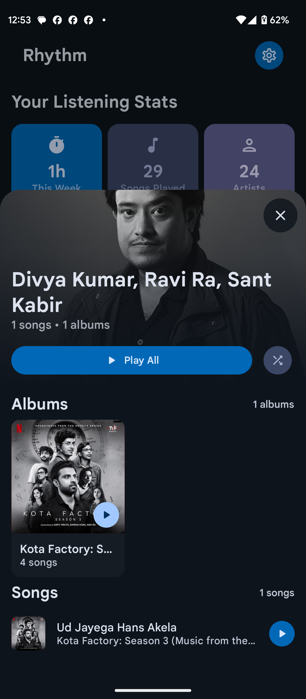

<div align="center">

<picture>
  <source media="(prefers-color-scheme: dark)" srcset="assets/icon.png">
  <source media="(prefers-color-scheme: light)" srcset="assets/icon.png">
  
</picture>

### **Project Rhythm**

*Your Music, Your Rhythm*

---

<div align="center">

[](https://android.com)
[](https://android-arsenal.com/api?level=26)
[](https://kotlinlang.org/)
[](LICENSE)

[](https://github.com/cromaguy/Rhythm/releases/latest)
[](https://github.com/cromaguy/Rhythm/releases)
[](https://github.com/cromaguy/Rhythm/stargazers)

</div>

---

<div align="center">

### 🌐 **[Visit Our Website](https://rhythmweb.vercel.app/)** | 📥 **[Download Latest Release](https://github.com/cromaguy/Rhythm/releases/latest)** | 💬 **[Join Telegram Community](https://t.me/RhythmSupport)**

</div>

---

</div>

## 📖 **Table of Contents**

<details open>
<summary>Click to expand</summary>

- [✨ What Makes Rhythm Special](#-what-makes-rhythm-special)
- [📱 Screenshots](#-screenshots)
- [🚀 Download & Install](#-download--install)
- [🎯 Using Rhythm After Installation](#-using-rhythm-after-installation)
- [🛠 Technology Stack](#-technology-stack)
- [📦 Open Source Libraries](#-open-source-libraries)
- [🤝 Contributing](#-contributing)
- [🏆 Credits & Acknowledgments](#-credits--acknowledgments)
- [📄 License](#-license)

</details>

---

## ✨ **What Makes Rhythm Special**

Rhythm is not just another music player - it's a complete audio experience designed with passion and attention to detail. Here's what sets us apart:

### 🎨 **Material You Excellence**
- ✨ **Dynamic Theming** - Colors extracted from your wallpaper (Android 12+)
- 🌓 **Adaptive UI** - Seamless light/dark mode transitions
- 🎭 **Physics-based Animations** - Smooth, natural motion throughout
- 📐 **Responsive Design** - Perfect on phones, tablets, and foldables
- 🎨 **Custom Color Schemes** - Personalize your experience

### 🎵 **Professional Audio Engine**
- 🎧 **Media3 ExoPlayer** - Studio-quality audio playback
- 🔊 **Gapless Playback** - Perfect transitions between tracks
- 📻 **Smart Audio Focus** - Handles calls and notifications elegantly
- 🎼 **Format Support** - FLAC, ALAC, MP3, AAC, OGG, WAV, and more
- 🔉 **Volume Control** - Independent app volume or system integration

### 🎵 **Audio Format Support & Limitations**

Rhythm uses **Media3 ExoPlayer 1.8.0** for professional-grade audio playback with comprehensive format support. Here's what you can expect:

#### ✅ **Fully Supported Formats** (Out-of-the-Box)
| Format | Container | Quality | Notes |
|:---:|:---:|:---:|:---|
| **FLAC** | `.flac` | Lossless | Full support for all bit depths and sample rates |
| **ALAC** | `.m4a`, `.alac` | Lossless | Native Apple Lossless support |
| **MP3** | `.mp3` | Lossy | All bitrates and VBR support |
| **AAC** | `.m4a`, `.aac`, `.mp4` | Lossy | AAC-LC, HE-AAC, HE-AACv2 |
| **Vorbis** | `.ogg` | Lossy | Ogg Vorbis audio |
| **Opus** | `.opus`, `.ogg` | Lossy/Lossless | Modern, efficient codec |
| **WAV** | `.wav` | Lossless | Uncompressed PCM audio |
| **PCM** | Various | Lossless | Raw audio data |

#### ⚠️ **Device-Dependent Formats** (Requires Hardware Support)
| Format | Container | Notes |
|:---:|:---:|:---|
| **Dolby Digital (AC-3)** | `.ac3`, `.m4a` | Requires compatible device/hardware |
| **Dolby Digital Plus (E-AC-3)** | `.eac3`, `.m4a` | Requires compatible device/hardware |
| **DTS** | `.dts`, `.m4a` | Requires compatible device/hardware |
| **Dolby Atmos** | Various | Requires Atmos-compatible device |
| **WMA** | `.wma` | May require device codecs |

#### ❌ **Not Supported Formats**
| Format | Alternative |
|:---:|:---|
| **APE (Monkey's Audio)** | Convert to FLAC |
| **DSD/DSF** | Convert to FLAC or PCM |
| **MQA** | Use FLAC version |
| **WMA Lossless** | Convert to FLAC |
| **AIFF** | Convert to WAV |

#### 📊 **Audio Quality Detection**
Rhythm automatically detects and displays audio quality badges:
- **Lossless**: FLAC, ALAC, WAV, PCM
- **Dolby**: AC-3, E-AC-3, Atmos
- **DTS**: DTS Audio
- **Hi-Res**: ≥48kHz sample rate or lossless

#### 🔧 **Technical Limitations**
- **Container Detection**: Some formats use identical containers (e.g., AAC and ALAC both use .m4a)
- **Hardware Dependencies**: Dolby/DTS formats require device-specific decoders
- **Codec Extensions**: Rare formats may need additional libraries (not included by default)
- **Bit Depth**: Limited to device capabilities (typically 16-bit or 24-bit)
- **Sample Rate**: Limited to device hardware (typically up to 192kHz)

#### 💡 **Recommendations**
- **For Best Compatibility**: Use FLAC, MP3, or AAC formats
- **For Lossless Audio**: FLAC is universally supported and recommended
- **For Hi-Res Audio**: Check your device's capabilities first
- **Format Conversion**: Use tools like FFmpeg or dBpoweramp for unsupported formats

> **Note**: If a format doesn't play, it may be due to device/exoplayer limitations rather than app issues. Try converting to a supported format or check your device's audio capabilities.

### 🧠 **Intelligent Features**
- 🎤 **Synchronized Lyrics** - Real-time lyrics with LRCLib integration
- 🔍 **Smart Search** - Lightning-fast fuzzy search across your library
- 🎲 **Advanced Shuffle** - True random, artist-aware, and weighted algorithms
- 💾 **Auto-Resume** - Picks up exactly where you left off
- 📊 **Rich Metadata** - Beautiful album art and comprehensive tag support

### 🌐 **Connected Experience**
- 🌍 **LRCLib Integration** - Community-driven synced lyrics
- 🔄 **Auto-Updates** - Stay up-to-date via GitHub releases
- 🎨 **Spotify Canvas** - Dynamic visual experience for your music
- 🖼️ **Online Artwork** - Fetch high-quality album art from Deezer
- 📱 **Telegram Support** - Join our active community

---

## 📱 Screenshots

<div align="center">
<table>
<tr>
<td align="center" width="25%">

<br/><b>🏠 Smart Home</b>
</td>
<td align="center" width="25%">

<br/><b>▶️ Beautiful Player</b>
</td>
<td align="center" width="25%">

<br/><b>🎤 Synced Lyrics</b>
</td>
<td align="center" width="25%">

<br/><b>📚 Rich Library</b>
</td>
</tr>
<tr>
<td align="center">

<br/><b>📋 Smart Queue</b>
</td>
<td align="center">

<br/><b>🔍 Instant Search</b>
</td>
<td align="center">

<br/><b>⚙️ Deep Settings</b>
</td>
<td align="center">

<br/><b>🎤 Artist Pages</b>
</td>
</tr>
</table>
</div>

---

## 🚀 **Download & Install**

<div align="center">

### 📦 **Get Rhythm Now**

[](https://github.com/cromaguy/Rhythm/releases/latest)
[](https://apt.izzysoft.de/fdroid/index/apk/chromahub.rhythm.app)

**System Requirements:** Android 8.0+ (API 26) • 2GB RAM • 50MB Storage

</div>

---

### 🛠 **Installation Methods**

#### 📱 **Direct APK Installation**
1. 📥 Visit our [Releases](https://github.com/cromaguy/Rhythm/releases) page
2. 💾 Download the latest `Rhythm-vX.X.X-release.apk` file
3. ⚙️ Enable "Install from unknown sources" in your device settings
4. 📲 Open the downloaded APK and install
5. 🎉 Launch Rhythm and enjoy your music!

> **Note:** The APK is signed with our official keystore for security

#### 🔒 **F-Droid (IzzyOnDroid Repository)**
1. 📱 Install [F-Droid](https://f-droid.org/) if you haven't already
2. ➕ Add IzzyOnDroid repository: `https://apt.izzysoft.de/fdroid/repo`
3. 🔍 Search for "Rhythm" in F-Droid
4. 📥 Install directly from the app
5. 🔄 Enjoy automatic updates!

> **Recommended for privacy-conscious users**

---

## 🎯 **Using Rhythm After Installation**

After installing Rhythm, you'll go through a comprehensive onboarding process to set up your music experience. Here's what to expect and how to use the app effectively.

### 📋 **First-Time Setup (Onboarding)**

Rhythm features a 9-step guided setup to personalize your music experience:

#### 1. **👋 Welcome Screen**
- Introduction to Rhythm's features
- Overview of the setup process
- Click "Get Started" to begin

#### 2. **🔐 Permission Setup**
- **Storage Access**: Required to scan and play your music files
- **Notification Access** (Android 13+): For playback controls and updates
- **Bluetooth Access**: For wireless audio output devices
- Grant permissions to continue with setup

#### 3. **💾 Backup & Restore**
- Choose whether to restore from a previous backup
- Set up automatic backup preferences
- Configure backup frequency and location

#### 4. **🎵 Audio & Playback Settings**
- Configure audio output preferences
- Set up gapless playback options
- Choose volume control behavior
- Configure audio focus handling

#### 5. **🎨 Theming & Appearance**
- Select light/dark theme or system default
- Enable Material You dynamic colors (Android 12+)
- Choose accent colors and app appearance
- Set up custom color schemes

#### 6. **📚 Library Organization**
- Configure how your music library is organized
- Set sorting preferences (by artist, album, date, etc.)
- Choose grid or list view layouts
- Configure metadata display options

#### 7. **🔍 Media Scanning**
- Choose between blacklist or whitelist filtering
- Set up folders to include/exclude from scanning
- Configure automatic media scanning
- Review scan results and library statistics

#### 8. **⬆️ Update Preferences**
- Configure automatic update checking
- Choose update channel (stable/beta)
- Set update notification preferences
- Enable background update downloads

#### 9. **✅ Setup Complete**
- Review your configuration
- Start initial media scan
- Begin using Rhythm!

### 🔑 **App Permissions Explained**

Rhythm requests the following permissions for optimal functionality:

| Permission | Why Needed | Where Used |
|:---|:---|:---|
| **📁 Storage Access**<br>`READ_EXTERNAL_STORAGE` (API ≤32)<br>`WRITE_EXTERNAL_STORAGE` (API ≤29)<br>`READ_MEDIA_AUDIO`<br>`READ_MEDIA_IMAGES`<br>`READ_MEDIA_VISUAL_USER_SELECTED` | Access music files and album artwork on your device | • Media library scanning<br>• Music playback<br>• Album art display<br>• Playlist management<br>• Metadata editing |
| **🔔 Notifications**<br>`POST_NOTIFICATIONS` | Show playback controls and update notifications | • Media notification controls<br>• Update availability alerts<br>• Background playback status |
| **📶 Internet Access**<br>`INTERNET`<br>`ACCESS_NETWORK_STATE` | Fetch lyrics, artwork, and app updates | • LRCLib lyrics integration<br>• Online album artwork<br>• GitHub update checking<br>• Deezer & YouTube Music APIs |
| **🎧 Audio Settings**<br>`MODIFY_AUDIO_SETTINGS` | Control audio output and routing | • Audio focus management<br>• Bluetooth device switching<br>• Volume control integration<br>• Equalizer support |
| **📱 Bluetooth**<br>`BLUETOOTH`<br>`BLUETOOTH_ADMIN` (API ≤30)<br>`BLUETOOTH_CONNECT`<br>`BLUETOOTH_SCAN` | Connect to wireless audio devices | • Bluetooth speaker/headphone support<br>• Audio output device selection<br>• Wireless playback controls |
| **📲 Install Packages**<br>`REQUEST_INSTALL_PACKAGES` | Install app updates automatically | • In-app APK installation<br>• Automatic update deployment |
| **🎵 Media Playback**<br>`FOREGROUND_SERVICE`<br>`FOREGROUND_SERVICE_MEDIA_PLAYBACK` | Background music playback | • Continuous music playback<br>• Lock screen controls<br>• Background audio processing |

> **Privacy Note**: Rhythm is fully FOSS-compliant and only uses standard media permissions. We removed `MANAGE_EXTERNAL_STORAGE` and `ACCESS_MEDIA_LOCATION` as they're not needed for music playback. All permissions are used solely for the app's core functionality, and no personal data is ever uploaded.

### 🎵 **Basic App Usage**

#### **Getting Started**
1. **Launch the App**: Open Rhythm from your app drawer
2. **Grant Permissions**: Allow access to your music library
3. **Wait for Scan**: Initial media scan may take a few minutes
4. **Start Playing**: Browse your library and tap any song to play

#### **Main Features**
- **🏠 Home Screen**: Quick access to recently played, favorites, and recommendations
- **▶️ Player**: Full-screen player with lyrics, queue, and controls
- **📚 Library**: Browse by songs, albums, artists, playlists, and folders
- **🔍 Search**: Fast fuzzy search across your entire music collection
- **📋 Queue**: Manage playback queue and upcoming tracks
- **⚙️ Settings**: Customize appearance, audio, and behavior

#### **Playback Controls**
- **Play/Pause**: Tap the play button or use notification controls
- **Skip Tracks**: Use next/previous buttons or swipe gestures
- **Shuffle/Repeat**: Access from player controls or notification
- **Volume**: Use device volume buttons or in-app slider
- **Seek**: Drag the progress bar to jump to any position

#### **Library Management**
- **Add to Playlists**: Long-press songs to create or add to playlists
- **Edit Metadata**: View and edit song information and album art
  - ⚠️ **Android 11+ Limitation**: Can only modify files created by Rhythm due to scoped storage restrictions
  - Files imported from other sources will be read-only
  - Metadata changes will still update in the app's library
- **Blacklist Folders**: Exclude unwanted folders from your library
- **Backup/Restore**: Protect your playlists and settings

#### **Customization**
- **Themes**: Switch between light/dark modes and custom colors
- **Equalizer**: Access system equalizer for audio adjustments
- **Sleep Timer**: Set automatic playback stop time
- **Output Selection**: Choose audio output device (speaker, Bluetooth, etc.)

### 🆘 **Troubleshooting**

#### **Permission Issues**
- Go to **Settings → Apps → Rhythm → Permissions** to grant manually
- Restart the app after granting permissions
- Check that storage access is enabled for your music folders

#### **Metadata Editing Limitations (Android 11+)**
- **Cannot modify files**: Due to Android's scoped storage security model, apps can only modify files they created
- **Read-only files**: Music files imported from other sources, downloads, or file transfers cannot be edited
- **What still works**: 
  - ✅ Metadata changes update in Rhythm's library (playlists, sorting, search)
  - ✅ Files created/recorded by Rhythm can be edited
  - ✅ View all metadata for any file
- **Why this happens**: 
  - Android 11+ prevents apps from modifying files they don't own to protect user data
  - This is a system-level security restriction, not an app limitation
  - Other music players face the same restriction
- **Workaround**: Use a desktop app or dedicated metadata editor that has broader file access

#### **Media Scanning Problems**
- Ensure music files are in accessible locations
- Check blacklist/whitelist settings in **Settings → Library**
- Try rescanning media from **Settings → Library → Rescan Media**

#### **Playback Issues**
- Check audio output device selection
- Verify Bluetooth connection if using wireless audio
- Clear app cache if experiencing audio glitches

#### **Update Problems**
- Check internet connection for update downloads
- Enable "Install from unknown sources" for APK updates
- Download updates manually from our [Releases](https://github.com/cromaguy/Rhythm/releases) page

### 📞 **Getting Help**

- **📱 In-App Help**: Access help from Settings → About → Help
- **💬 Community Support**: Join our [Telegram group](https://t.me/RhythmSupport)
- **🐛 Report Issues**: Use [GitHub Issues](https://github.com/cromaguy/Rhythm/issues) for bugs
- **📖 Documentation**: Check our [website](https://rhythmweb.vercel.app/) for guides

---

## 🛠 **Technology Stack**

<div align="center">

| **Category** | **Technology** | **Purpose** |
|:---:|:---:|:---|
| 🎨 **UI Framework** | **Jetpack Compose** | Modern declarative UI toolkit for Android |
| 🎭 **Design System** | **Material 3** | Latest Material Design components and theming |
| 🎵 **Audio Engine** | **Media3 ExoPlayer** | Professional-grade media playback |
| 💻 **Language** | **Kotlin 100%** | Modern, safe, and concise programming |
| 🏗️ **Architecture** | **MVVM + Clean** | Separation of concerns and testability |
| ⚡ **Async** | **Coroutines & Flow** | Reactive and efficient asynchronous programming |
| 🔄 **State Management** | **StateFlow** | Reactive UI state management |
| 🧭 **Navigation** | **Navigation Compose** | Type-safe navigation between screens |
| 🖼️ **Image Loading** | **Coil** | Efficient image loading and caching |
| 🌐 **Networking** | **Retrofit + OkHttp** | Type-safe HTTP client |
| 📦 **Serialization** | **Gson** | JSON parsing and serialization |
| 🎨 **Color Extraction** | **Palette** | Dynamic color extraction from images |
| 👆 **Permissions** | **Accompanist** | Compose utilities for runtime permissions |
| 🔧 **Build System** | **Gradle KTS** | Kotlin-based build configuration |

</div>

### 🏗 **Architecture & Design Patterns**

```
app/
├── 📱 ui/
│   ├── screens/          # Composable screens (Home, Player, Library, etc.)
│   ├── components/       # Reusable UI components
│   ├── navigation/       # Navigation graph and routes
│   └── theme/            # Material 3 theming and colors
├── 🎵 domain/
│   ├── models/           # Data models (Song, Album, Artist, Playlist)
│   ├── repository/       # Repository interfaces
│   └── usecases/         # Business logic use cases
├── 💾 data/
│   ├── local/            # Local data sources (MediaStore, Room)
│   ├── remote/           # Remote data sources (APIs)
│   └── repository/       # Repository implementations
├── 🎼 services/
│   ├── MusicService      # Background music playback service
│   └── MediaNotification # Media notification handling
└── 🔧 utils/             # Utility classes and helpers
```

**Key Patterns:**
- ✅ **MVVM (Model-View-ViewModel)** - Clear separation of UI and business logic
- ✅ **Repository Pattern** - Abstract data sources
- ✅ **Use Case Pattern** - Encapsulate business logic
- ✅ **Dependency Injection** - Loose coupling and testability
- ✅ **Observer Pattern** - Reactive data flow with Flow and StateFlow
- ✅ **State Hoisting** - Compose best practices for state management

### 🌐 **External Integrations**

- **LRCLib** - Community-driven synced lyrics database (Free)
- **Deezer API** - High-quality album artwork and artist images (Free)
- **Spotify Canvas API** - Dynamic visual experience for tracks (Community)
- **GitHub API** - Automatic update checking and releases (Free)
- **YouTube Music API** - Fallback for missing metadata and artwork (Community)

---


## 📦 **Open Source Libraries**

Rhythm is built on the shoulders of giants. We use the following open source libraries:

<details>
<summary><b>Click to view all dependencies</b></summary>

| **Library** | **Purpose** | **License** |
|:---|:---|:---:|
| **[Jetpack Compose](https://developer.android.com/jetpack/compose)** | Modern UI toolkit for Android | Apache 2.0 |
| **[Material 3](https://m3.material.io/)** | Material Design components | Apache 2.0 |
| **[Media3 ExoPlayer](https://github.com/androidx/media)** | Media playback library | Apache 2.0 |
| **[Kotlin Coroutines](https://github.com/Kotlin/kotlinx.coroutines)** | Asynchronous programming | Apache 2.0 |
| **[Kotlin Flow](https://kotlinlang.org/docs/flow.html)** | Reactive streams | Apache 2.0 |
| **[AndroidX Navigation](https://developer.android.com/guide/navigation)** | Navigation components | Apache 2.0 |
| **[Coil](https://coil-kt.github.io/coil/)** | Image loading library | Apache 2.0 |
| **[Retrofit](https://square.github.io/retrofit/)** | Type-safe HTTP client | Apache 2.0 |
| **[OkHttp](https://square.github.io/okhttp/)** | HTTP client | Apache 2.0 |
| **[Gson](https://github.com/google/gson)** | JSON serialization | Apache 2.0 |
| **[Accompanist Permissions](https://google.github.io/accompanist/permissions/)** | Permission handling | Apache 2.0 |
| **[AndroidX Palette](https://developer.android.com/jetpack/androidx/releases/palette)** | Color extraction | Apache 2.0 |
| **[AndroidX Core KTX](https://developer.android.com/kotlin/ktx)** | Kotlin extensions | Apache 2.0 |
| **[AndroidX Lifecycle](https://developer.android.com/topic/libraries/architecture/lifecycle)** | Lifecycle management | Apache 2.0 |
| **[Material Icons Extended](https://developer.android.com/jetpack/compose/graphics/images/material)** | Comprehensive icon set | Apache 2.0 |

</details>

**All libraries are licensed under Apache License 2.0**, which permits use, reproduction, and distribution with proper attribution.

### 🙏 **Special Thanks**

We're grateful to:
- **Google** - Android platform, Jetpack libraries, Material Design
- **JetBrains** - Kotlin programming language
- **Square** - Retrofit and OkHttp libraries
- **Coil** - Excellent image loading solution
- **Open Source Community** - For continuous inspiration and support

---

## 🤝 **Contributing**

We believe great software is built by great communities! Here's how you can help make Rhythm even better:

### 🐛 **Report Issues**

Found a bug? Help us squash it!

1. 🔍 Check if the issue already exists in our [Issue Tracker](https://github.com/cromaguy/Rhythm/issues)
2. 📝 Create a new issue with:
   - Clear title and description
   - Steps to reproduce
   - Expected vs actual behavior
   - Device info (Android version, device model)
   - Screenshots/logs if applicable
3. 🏷️ Add appropriate labels

### 💡 **Suggest Features**

Have an idea? We'd love to hear it!

1. 💭 Check existing [Feature Requests](https://github.com/cromaguy/Rhythm/issues?q=is%3Aissue+is%3Aopen+label%3Aenhancement)
2. 📋 Create a new feature request with:
   - Clear use case
   - Expected behavior
   - Why it would benefit users
   - Optional: UI mockups or references
3. 💬 Discuss with the community

### 👨‍💻 **Code Contributions**

Ready to contribute code? Awesome! Follow these steps:

```bash
# 1. Fork the repository
# Click "Fork" button on GitHub

# 2. Clone your fork
git clone https://github.com/YOUR_USERNAME/Rhythm.git
cd Rhythm

# 3. Create a feature branch
git checkout -b feature/amazing-feature

# 4. Make your changes
# Follow our coding standards (see below)

# 5. Test your changes
./gradlew test
# Test on actual device/emulator

# 6. Commit with clear messages
git commit -m "feat: add amazing feature"
# Use conventional commits format

# 7. Push to your fork
git push origin feature/amazing-feature

# 8. Create a Pull Request
# Go to GitHub and click "New Pull Request"
# Provide detailed description of changes
```

### 📋 **Coding Standards**

- ✅ Follow [Kotlin coding conventions](https://kotlinlang.org/docs/coding-conventions.html)
- ✅ Use **Jetpack Compose** best practices
- ✅ Maintain **Material 3** design consistency
- ✅ Write **clean, readable code** with meaningful names
- ✅ Add **comments** for complex logic
- ✅ Write **unit tests** for new features
- ✅ Update **documentation** as needed
- ✅ Keep **dependencies** up to date
- ✅ Use **StateFlow** for reactive state management
- ✅ Follow **MVVM** architecture pattern

### 🎨 **UI/UX Contributions**

Design skills? Help improve our UI/UX!

- Create mockups for new features
- Suggest improvements to existing screens
- Design new icons or assets
- Improve accessibility features
- Enhance animations and transitions

### 📝 **Documentation**

Help others understand Rhythm better:

- Improve README documentation
- Write tutorials or guides
- Translate to other languages
- Create video tutorials
- Document APIs and functions

### 💬 **Community Support**

Help fellow users:

- Answer questions in [Discussions](https://github.com/cromaguy/Rhythm/discussions)
- Join our [Telegram group](https://t.me/RhythmSupport)
- Share your experience
- Help with testing beta releases

---

## 🏆 **Credits & Acknowledgments**

### 👨‍💻 **Core Team**

<table>
<tr>
<td align="center" width="100%">
<a href="https://github.com/cromaguy">
<br />
<sub><b>Anjishnu Nandi</b></sub>
</a><br />
<sub>Lead Developer & Project Architect</sub><br />
<sub>Core development, UI/UX design, Head of Team ChromaHub</sub>
</td>
</tr>
</table>

### 🌟 **Community Contributors**

We're grateful to these amazing individuals who have contributed to making Rhythm better:

- **[Izzy](https://github.com/IzzySoft)** - Manages updates on IzzyOnDroid
- **[Christian](https://github.com/mardous)** - Collaboration & Project Booming's Lead Dev
- **[Alex](https://github.com/Paxsenix0)** - Spotify Canvas API Integration
- **[DJ SMAS](https://github.com/smas7832)** - UI/UX Feedback & Suggestions

### 💖 **Special Thanks**

- **Google Material Design Team** - For the beautiful Material You design system
- **Android Open Source Project** - For the amazing Android platform
- **Jetpack Compose Team** - For revolutionizing Android UI development
- **Open Source Community** - For continuous inspiration, libraries, and support
- **All Beta Testers** - For invaluable feedback and bug reports
- **Our Users** - For choosing Rhythm and making it better with your feedback

---

## 📄 **License**

```
MIT License

Copyright (c) 2025 Team ChromaHub

Permission is hereby granted, free of charge, to any person obtaining a copy
of this software and associated documentation files (the "Software"), to deal
in the Software without restriction, including without limitation the rights
to use, copy, modify, merge, publish, distribute, sublicense, and/or sell
copies of the Software, and to permit persons to whom the Software is
furnished to do so, subject to the following conditions:

The above copyright notice and this permission notice shall be included in all
copies or substantial portions of the Software.

THE SOFTWARE IS PROVIDED "AS IS", WITHOUT WARRANTY OF ANY KIND, EXPRESS OR
IMPLIED, INCLUDING BUT NOT LIMITED TO THE WARRANTIES OF MERCHANTABILITY,
FITNESS FOR A PARTICULAR PURPOSE AND NONINFRINGEMENT. IN NO EVENT SHALL THE
AUTHORS OR COPYRIGHT HOLDERS BE LIABLE FOR ANY CLAIM, DAMAGES OR OTHER
LIABILITY, WHETHER IN AN ACTION OF CONTRACT, TORT OR OTHERWISE, ARISING FROM,
OUT OF OR IN CONNECTION WITH THE SOFTWARE OR THE USE OR OTHER DEALINGS IN THE
SOFTWARE.
```

**TL;DR:** You can freely use, modify, and distribute this software. See [LICENSE](LICENSE) file for complete details.

---

## 🔗 **Links & Resources**

<div align="center">

| Resource | Link |
|:---|:---:|
| 🌐 **Official Website** | [rhythmweb.vercel.app](https://rhythmweb.vercel.app/) |
| 📥 **Latest Release** | [Download APK](https://github.com/cromaguy/Rhythm/releases/latest) |
| 🐙 **GitHub Repository** | [cromaguy/Rhythm](https://github.com/cromaguy/Rhythm) |
| 📱 **IzzyOnDroid** | [F-Droid Repo](https://apt.izzysoft.de/fdroid/index/apk/chromahub.rhythm.app) |
| 💬 **Telegram Support** | [Join Group](https://t.me/RhythmSupport) |
| 🐛 **Issue Tracker** | [Report Bug](https://github.com/cromaguy/Rhythm/issues) |
| 💡 **Discussions** | [Community Forum](https://github.com/cromaguy/Rhythm/discussions) |
| ⭐ **Star on GitHub** | [Show Support](https://github.com/cromaguy/Rhythm/stargazers) |

</div>

---

## 📊 **Project Stats**

<div align="center">


</div>

---

<div align="center">

## 🎵 **Ready to Transform Your Music Experience?** 🎵

<br>

[](https://github.com/cromaguy/Rhythm/releases/latest)
[](https://rhythmweb.vercel.app/)
[](https://github.com/cromaguy/Rhythm)
[](https://t.me/RhythmSupport)

<br><br>

### ✨ **Made with ❤️ by Team ChromaHub** ✨

<br>


<br><br>

---

<sub>⭐ If you like Rhythm, don't forget to star the repository! ⭐</sub>

<br>

<sub>© 2025 Team ChromaHub. All rights reserved. Licensed under MIT License.</sub>

</div>
