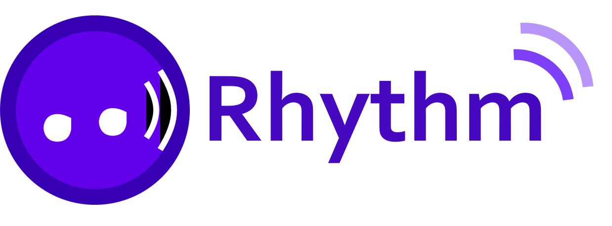
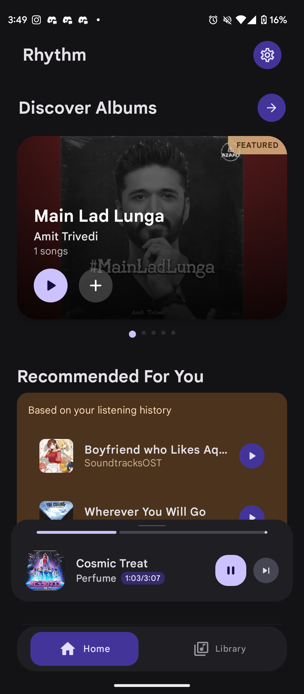
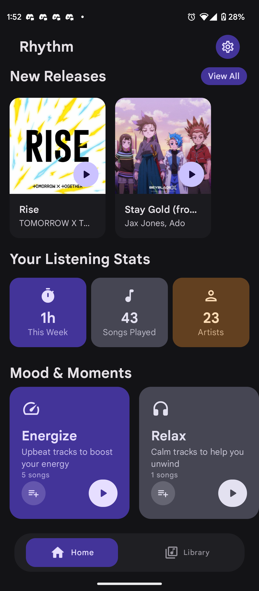
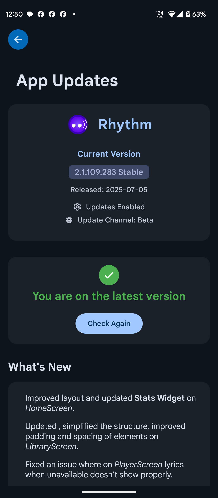

<div align="center">
  <h1>🎵 Rhythm - Offline Music Player</h1>
  
  [](https://github.com/cromaguy/Rhythm/releases/latest)
  [](https://apt.izzysoft.de/fdroid/index/apk/chromahub.rhythm.app)
  [](LICENSE)
  
  
  
  ### A modern, feature-rich Android music player built with Jetpack Compose and Material 3
</div>

## Features

- 🎨 **Modern UI**: Built with Jetpack Compose and Material 3 design
- 🎵 **Comprehensive Audio Support**: Plays various formats including MP3, AAC, FLAC, OGG, WAV
- 📱 **Android Support**: Targets Android API 34 with compatibility down to Android 8.0
- 🎯 **Media3 Integration**: Robust media playback using ExoPlayer
- 📂 **Advanced Playlist Management**: Create, edit, and organize playlists
- 🔄 **Background Playback**: Continuous playback with foreground service
- 🎨 **Dynamic Theming**: Material You/Monet theming and fluid animations
- 🔊 **Smart Audio**: Gapless playback, crossfade, audio normalization
- 🎵 **Advanced Features**: Equalizer, high-quality mode, replay gain
- 🔊 **Output Control**: Seamless audio device and Bluetooth switching
- 📊 **Personalization**: Listening stats, mood-based playlists
- 🌐 **Online Integration**: Automatic updates, online lyrics
- 🔄 **Auto-Resume**: Remembers playback state and queue
- 🎨 **Adaptive UI**: Beautiful transitions and responsive design

## 📱 Screenshots

<table>
  <tr>
    <td align="center">
      <br>
      <b>🎵 Home Screen 1</b>
    </td>
    <td align="center">
      <br>
      <b>🎵 Home Screen 2</b>
    </td>
    <td align="center">
      <br>
      <b>🎵 Home Screen 3</b>
    </td>
  </tr>
  <tr>
    <td align="center">
      <br>
      <b>▶️ Now Playing</b>
    </td>
    <td align="center">
      <br>
      <b>📝 Lyrics View</b>
    </td>
    <td align="center">
      <br>
      <b>🎼 Playlist View</b>
    </td>
  </tr>
  <tr>
      <td align="center">
      <br>
      <b>🎧 Songs Library</b>
    </td>
    <td align="center">
      <br>
      <b>💿 Albums View</b>
    </td>
    <td align="center">
      <br>
      <b>💿 Updater</b>
    </td>
  </tr>
  <tr>
    <td align="center">
      <br>
      <b>🔍 Search</b>
    </td>
    <td align="center">
      <br>
      <b>⏭️ Queue</b>
    </td>
    <td align="center">
      <br>
      <b>⚙️ Settings</b>
    </td>
  </tr>
</table>

## 🛠 Technical Stack

### Core Technologies
- **Language**: Kotlin with Coroutines & Flow
- **UI Framework**: Jetpack Compose
- **Design System**: Material 3 (Material You)
- **Architecture**: MVVM with Clean Architecture
- **Dependency Injection**: Hilt

### Media & Audio
- **Media Playback**: Media3 ExoPlayer
- **Audio Processing**: Media3 Session, Audio Effects
- **Equalizer**: Android Audio Effects API

### Data & Storage
- **Local Storage**: Room Database
- **Preferences**: DataStore
- **File Access**: Storage Access Framework
- **Networking**: Retrofit2, OkHttp3

### UI Components
- **Navigation**: Compose Navigation
- **Image Loading**: Coil
- **Animations**: Compose Animation with Physics
- **Charts**: Custom Compose implementations

### Utilities
- **Dependency Injection**: Hilt
- **Concurrency**: Coroutines & Flow
- **Logging**: Timber
- **Testing**: JUnit, MockK, Espresso

## 📥 Installation

### Prerequisites
- Android 8.0+ (API level 26)
- 50MB+ free storage space
- Internet connection for online features

### Download Options

#### Option 1: GitHub Releases
1. Visit the [Releases](https://github.com/cromaguy/Rhythm/releases) page
2. Download the latest APK
3. Open the downloaded file to install

#### Option 2: IzzySoft F-Droid
1. Add the IzzySoft repository to your F-Droid client:
   ```
   https://apt.izzysoft.de/fdroid/repo
   ```
2. Search for "Rhythm"
3. Install the app

## 🏗 Project Structure

```
app/
├── src/
│   ├── main/
│   │   ├── java/chromahub/rhythm/app/
│   │   │   ├── di/                # Dependency Injection modules
│   │   │   ├── player/            # Media player components
│   │   │   ├── ui/                # All UI components
│   │   │   │   ├── components/    # Reusable UI components
│   │   │   │   ├── screens/       # App screens
│   │   │   │   └── theme/        # Theming and styling
│   │   │   ├── utils/            # Utility classes
│   │   │   └── MainActivity.kt   # App entry point
│   │   ├── res/                  # Resources
│   │   └── AndroidManifest.xml   # App manifest
│   ├── test/                     # Unit tests
│   └── androidTest/              # Instrumentation tests
├── build.gradle.kts              # App-level build configuration
└── proguard-rules.pro           # ProGuard rules
```

## 🤝 Contributing

Contributions are what make the open source community such an amazing place to learn, inspire, and create. Any contributions you make are **greatly appreciated**.

1. Fork the Project
2. Create your Feature Branch (`git checkout -b feature/AmazingFeature`)
3. Commit your Changes (`git commit -m 'Add some AmazingFeature'`)
4. Push to the Branch (`git push origin feature/AmazingFeature`)
5. Open a Pull Request

### Code Style
- Follow [Kotlin Coding Conventions](https://kotlinlang.org/docs/coding-conventions.html)
- Use descriptive variable and function names
- Add comments for complex logic
- Write unit tests for new features

## 📄 License

Distributed under the MIT License. See `LICENSE` for more information.

## 🙏 Acknowledgments

- [Jetpack Compose](https://developer.android.com/jetpack/compose)
- [Media3](https://developer.android.com/guide/topics/media/media3)
- [Material Design 3](https://m3.material.io/)
- [Coil](https://coil-kt.github.io/coil/)

## Permissions

The app requires the following permissions:

- `READ_EXTERNAL_STORAGE` (Android 12 and below) for media files
- `WRITE_EXTERNAL_STORAGE` (Android 10 and below) for media files
- `READ_MEDIA_AUDIO` (Android 13 and above) for media files
- `READ_MEDIA_IMAGES` (Android 13 and above) for album art
- `FOREGROUND_SERVICE` for background playback
- `FOREGROUND_SERVICE_MEDIA_PLAYBACK` for media playback service
- `INTERNET` for online features (lyrics, updates)
- `ACCESS_NETWORK_STATE` for network connectivity checks
- `REQUEST_INSTALL_PACKAGES` for in-app updates
- `BLUETOOTH`, `BLUETOOTH_ADMIN`, `BLUETOOTH_CONNECT`, `BLUETOOTH_SCAN` for Bluetooth device integration

## 📄 License

Rhythm is available under the MIT license. See the [LICENSE](LICENSE) file for more info.

## Download

[](https://github.com/cromaguy/Rhythm/releases/latest)
[](https://apt.izzysoft.de/fdroid/index/apk/chromahub.rhythm.app)

## Version

Current version: 2.1.109.283

## Support

If you encounter any issues or have feature requests, please file them in the [Issues](https://github.com/cromaguy/Rhythm/issues) section.

<div align="center">
  <sub>Made with ❤️ by Anjishnu</sub>
</div>
