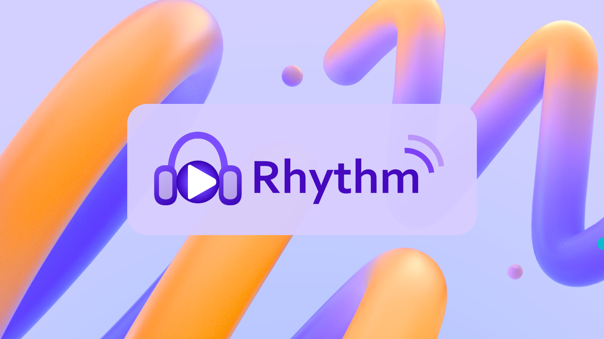
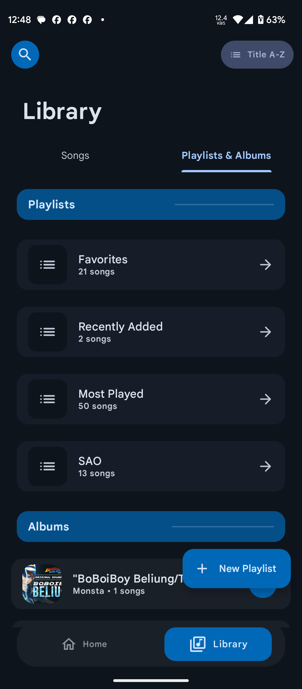
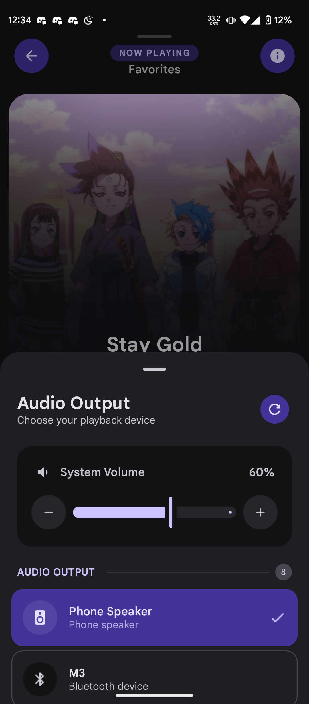
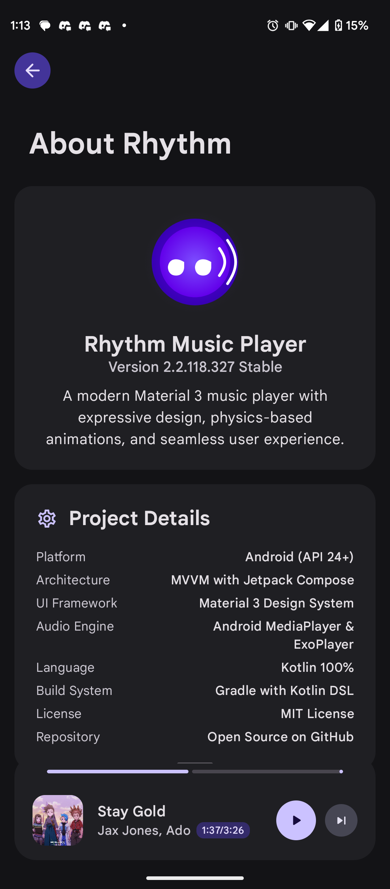

<div align="center">

# 🎵 Rhythm - Advanced Material 3 Music Player

[](https://android.com)
[](https://android-arsenal.com/api?level=26)
[](https://kotlinlang.org/)
[](LICENSE)
[](https://github.com/cromaguy/Rhythm/releases/latest)
[](https://apt.izzysoft.de/fdroid/index/apk/chromahub.rhythm.app)



### 🌟 A revolutionary Android music player built with cutting-edge Material 3 design, powered by modern architecture and enriched with intelligent features

<p align="center">
  <a href="#-features">✨ Features</a> •
  <a href="#-screenshots">📱 Screenshots</a> •
  <a href="#-technology-stack">🛠 Tech Stack</a> •
  <a href="#-download--installation">📥 Download</a> •
  <a href="#-configuration">⚙️ Configuration</a> •
  <a href="#-contributing">🤝 Contributing</a> •
  <a href="#-credits">🏆 Credits</a>
</p>

---

## 📊 Project Statistics


</div>

---

## ✨ Features

### 🎨 **Material 3 Design Excellence**
- 🌈 **Dynamic Colors (Monet)**: Wallpaper-based color extraction for personalized theming (Android 12+)
- 🌓 **Adaptive Theming**: Seamlessly follows system dark/light theme or manual selection
- 🎯 **Physics-Based Animations**: Smooth spring animations throughout the interface
- 📱 **Responsive Design**: Optimized layouts for different screen sizes and orientations
- ✨ **Modern UI Components**: Latest Material 3 components with consistent design language

### 🎵 **Professional Audio Engine**
- 🎧 **ExoPlayer Integration**: Industry-standard media playback with Media3 framework
- 🔄 **Gapless Playback**: Seamless transitions between tracks with advanced buffering
- 🎚️ **Audio Focus Management**: Intelligent handling of calls, notifications, and audio interruptions
- 🔊 **Volume Control Options**: System media volume or app-specific volume control
- ⚖️ **Audio Enhancement**: Built-in equalizer support and audio normalization
- 🎼 **High-Quality Audio**: Support for lossless formats (FLAC, ALAC) and high-bitrate files

### 📚 **Intelligent Library Management**
- ⚡ **Fast Indexing**: Advanced music library scanning with metadata extraction from ID3 tags
- 📊 **Multiple View Modes**: Grid and list views for songs, albums, artists, and playlists
- 🔍 **Smart Search**: Real-time search with fuzzy matching across all library content
- 📝 **Advanced Sorting**: Sort by title, artist, album, date, duration, genre, and more
- 🎼 **Playlist Management**: Create, edit, reorder, and delete custom playlists with drag-and-drop
- 📊 **Library Statistics**: Track listening habits, play counts, and favorite genres

### 🎤 **Synchronized Lyrics & Rich Metadata**
- 🎵 **Time-Synced Lyrics**: Real-time highlighting with smooth scrolling
- 🌐 **LRCLib Integration**: Automatic lyrics fetching from the community-driven service
- 💿 **Rich Song Information**: Bitrate, format, file size, encoding details, and more
- 🖼️ **High-Quality Artwork**: Multi-source artwork fetching with intelligent fallbacks
- 📱 **Offline/Online Modes**: Choose between cached or always-online lyrics

### 🔄 **Smart Playback Features**
- 🎲 **Advanced Shuffle**: Multiple shuffle algorithms (true random, album-aware, artist-aware)
- 🔁 **Repeat Modes**: Track repeat, playlist repeat, and queue repeat with visual indicators
- ⏮️ **Queue Management**: Advanced queue with history, upcoming tracks, and manual reordering
- 📈 **Recently Played**: Comprehensive listening history with timestamps
- 💾 **Auto-Resume**: Restore playback state, position, and queue after app restart
- 🎯 **Contextual Playback**: Intelligent queue creation based on user context

### 🌐 **Online Integration & Services**

#### **API Integrations**
- 🎵 **LRCLib**: Free, community-driven synchronized lyrics service
- 🎤 **Deezer API**: Free artist images and album artwork (no configuration needed)
- 🎶 **YouTube Music**: Fallback for artist images, album art, and track thumbnails
- 📊 **GitHub API**: Automatic app updates and release management

#### **Smart Features**
- 🔄 **Auto-Updates**: GitHub-based update checking with stable/beta channels
- 🏗️ **In-App Installation**: Seamless update installation without leaving the app
- 🎯 **Intelligent Caching**: Memory-efficient artwork and metadata caching
- 📡 **Network Awareness**: Offline/online mode switching based on connectivity

### 📱 **Device Integration**
- 🔊 **Audio Output Switching**: Easy switching between speakers, headphones, and Bluetooth devices
- 🎧 **Bluetooth Support**: Full Bluetooth audio device integration
- 📲 **Media Controls**: Lock screen and notification controls
- 🎮 **Hardware Keys**: Volume key navigation and media key support
- 🔄 **Auto-Connect**: Automatic connection to preferred audio devices

---

## 📱 Screenshots

<table>
  <tr>
    <td align="center">
      <br/>
      <b>🏠 Enhanced Home Screen</b>
    </td>
    <td align="center">
      <br/>
      <b>🎵 Smart Recommendations</b>
    </td>
    <td align="center">
      <br/>
      <b>📊 Personalized Content</b>
    </td>
  </tr>
  <tr>
    <td align="center">
      <br/>
      <b>▶️ Beautiful Player Interface</b>
    </td>
    <td align="center">
      <br/>
      <b>📝 Synchronized Lyrics</b>
    </td>
    <td align="center">
      <br/>
      <b>⏭️ Advanced Queue System</b>
    </td>
  </tr>
  <tr>
    <td align="center">
      <br/>
      <b>🎧 Comprehensive Library</b>
    </td>
    <td align="center">
      <br/>
      <b>💿 Album Collections</b>
    </td>
    <td align="center">
      <br/>
      <b>� Playlist Management</b>
    </td>
  </tr>
  <tr>
    <td align="center">
      <br/>
      <b>🔍 Smart Search</b>
    </td>
    <td align="center">
      <br/>
      <b>⚙️ Comprehensive Settings</b>
    </td>
    <td align="center">
      <br/>
      <b>🔄 Seamless Updates</b>
    </td>
  </tr>
  <tr>
    <td align="center">
      <br/>
      <b>🎤 Artist Profiles</b>
    </td>
    <td align="center">
      <br/>
      <b>🔊 Audio Output Control</b>
    </td>
    <td align="center">
      <br/>
      <b>ℹ️ App Information</b>
    </td>
  </tr>
</table>

---


## 🛠 Technology Stack

### 🎨 **UI Framework**
- **Jetpack Compose**: Modern declarative UI toolkit for native Android development
- **Material 3**: Latest Material Design components with dynamic theming and Material You
- **Coil**: Efficient image loading and caching with Compose integration

### 🏗️ **Architecture**
- **MVVM Pattern**: Model-View-ViewModel architecture for clean separation of concerns
- **Clean Architecture**: Layered architecture with clear dependency rules
- **Coroutines & Flow**: Asynchronous programming with structured concurrency
- **StateFlow**: Reactive state management for UI updates

### 🎵 **Media & Data**
- **ExoPlayer (Media3)**: Advanced media playback engine with gapless support and audio focus
- **MediaMetadataRetriever**: Audio metadata extraction and ID3 tag processing
- **Gson**: JSON serialization for data persistence and API communication
- **DataStore**: Modern preference storage replacing SharedPreferences

### 🌐 **Integrations**
- **GitHub API**: Automatic app updates and release management
- **LRCLib**: Free lyrics service integration with synchronized display
- **Deezer API**: Free artist images and album artwork (no configuration needed)
- **YouTube Music**: Fallback for artist images, album art, and track images

### 📊 **Data Management**
- **File-based Storage**: Music library indexing and playlist management
- **Memory Caching**: Efficient artwork and metadata caching strategies
- **Storage Access Framework**: Modern file access for Android 11+ compatibility

---

## 📥 Download

### 🚀 **Latest Release**
Get the latest version from our [GitHub Releases](https://github.com/cromaguy/Rhythm/releases/latest)


### 🎯 **Installation Methods**

#### **📱 Direct APK Download**
1. Visit our [Releases page](https://github.com/cromaguy/Rhythm/releases)
2. Download the latest `app-release.apk`
3. Enable "Unknown sources" in Android settings
4. Install the APK

#### **🔒 IzzyOnDroid F-Droid Repository**
1. Add IzzyOnDroid repo: `https://apt.izzysoft.de/fdroid/repo`
2. Search for "Rhythm Music Player"
3. Install directly through F-Droid client


### 📋 **System Requirements**
- **Android Version**: 7.1 (API 26) or higher
- **Storage**: 50MB+ for app installation
- **RAM**: 2GB+ recommended for smooth performance

---

## 🔧 Setup & Configuration

### 🎵 **First Launch**
1. **Grant Permissions**: Allow storage access for music scanning
2. **Library Scan**: Automatic music discovery from device storage
3. **Theme Selection**: Choose your preferred theme and color scheme

### ⚙️ **Settings Overview**

#### **🎨 Appearance**
- **System Theme**: Follow Android's Material You colors
- **Dynamic Colors**: Wallpaper-based color extraction (Android 12+)
- **Dark Mode**: Manual dark/light theme selection
- **Album View Type**: Choose between grid and list layouts

#### **🎵 Playback**
- **Show Lyrics**: Enable/disable synchronized lyrics display
- **Online Lyrics**: Choose between offline and online lyrics fetching
- **System Volume**: Control device media volume or app-specific volume
- **Equalizer**: Access system audio equalizer

#### **🔄 Updates**
- **Auto Check**: Automatic update checking from GitHub releases
- **Update Channel**: Choose between stable and beta release channels

---


## 🤝 Contributing

We welcome contributions from the community! Here's how you can help make RhythmM3 even better:

### **🐛 Bug Reports**
- Use the [Issue Tracker](https://github.com/cromaguy/Rhythm/issues) to report bugs
- Include detailed steps to reproduce the issue
- Provide device information and Android version  
- Attach logs or screenshots if applicable

### **💡 Feature Requests**
- Check existing issues to avoid duplicates
- Clearly describe the proposed feature and its benefits
- Consider implementation complexity and user impact

### **🔧 Code Contributions**
1. **Fork** the repository
2. **Create** a feature branch (`git checkout -b feature/amazing-feature`)
3. **Make** your changes following our coding standards
4. **Test** thoroughly on different devices and Android versions
5. **Commit** with clear, descriptive messages
6. **Push** to your branch (`git push origin feature/amazing-feature`)  
7. **Open** a Pull Request with detailed description

### **📋 Development Guidelines**
- Follow [Kotlin coding conventions](https://kotlinlang.org/docs/coding-conventions.html)
- Use Jetpack Compose best practices
- Ensure Material 3 design consistency
- Write unit tests for new features
- Update documentation as needed
- Test on multiple screen sizes and Android versions

---

## 🏆 Credits & Acknowledgments

### **👨‍💻 Development Team**
- **[Anjishnu Nandi](https://github.com/cromaguy)** - Lead Developer & Project Architect
  - Core development and UI/UX design
  - Architecture planning and implementation  
  - Material 3 design system integration

### **🌟 Special Thanks**
- **Google Material Design Team** - Material 3 design principles and components
- **Android Open Source Project** - Foundation of Android development
- **Jetpack Compose Team** - Modern declarative UI toolkit
- **Open Source Community** - Inspiration, libraries, and continuous support

### **📚 Core Libraries & Dependencies**
- **[Jetpack Compose](https://developer.android.com/jetpack/compose)** - Modern UI toolkit
- **[Material 3](https://m3.material.io/)** - Design system and components
- **[ExoPlayer/Media3](https://exoplayer.dev/)** - Professional media playback
- **[Coil](https://coil-kt.github.io/coil/)** - Image loading for Compose
- **[Kotlin Coroutines](https://kotlinlang.org/docs/coroutines-overview.html)** - Asynchronous programming

### **🎵 Audio & Metadata Services**
- **[LRCLib](https://lrclib.net/)** - Free, community-driven lyrics service
- **[Deezer API](https://developers.deezer.com/)** - Free artist images and album artwork
- **[YouTube Music](https://music.youtube.com/)** - Fallback artwork source

---

## 🔐 Permissions

### **📁 Storage Access**
- `READ_MEDIA_AUDIO` (Android 13+) - Access music files
- `READ_MEDIA_IMAGES` (Android 13+) - Access album artwork  
- `READ_EXTERNAL_STORAGE` (Legacy) - Storage access for older Android
- `WRITE_EXTERNAL_STORAGE` (Legacy) - Storage write for Android 10-

### **🎵 Media Playback**
- `FOREGROUND_SERVICE` - Background music playback
- `FOREGROUND_SERVICE_MEDIA_PLAYBACK` - Media-specific service
- `WAKE_LOCK` - Prevent device sleep during playback

### **🌐 Network Features**
- `INTERNET` - Online features (lyrics, updates, artwork)
- `ACCESS_NETWORK_STATE` - Network connectivity checks

### **🔄 Updates & Bluetooth**
- `REQUEST_INSTALL_PACKAGES` - In-app update installation
- `BLUETOOTH` & `BLUETOOTH_ADMIN` - Bluetooth device integration
- `BLUETOOTH_CONNECT` & `BLUETOOTH_SCAN` (Android 12+) - Modern Bluetooth

---

## 📄 License

This project is licensed under the **MIT License** - see the [LICENSE](LICENSE) file for details.

```
MIT License

Copyright (c) 2024 Team ChromaHub

Permission is hereby granted, free of charge, to any person obtaining a copy
of this software and associated documentation files (the "Software"), to deal
in the Software without restriction, including without limitation the rights
to use, copy, modify, merge, publish, distribute, sublicense, and/or sell
copies of the Software, and to permit persons to whom the Software is
furnished to do so, subject to the following conditions:

The above copyright notice and this permission notice shall be included in all
copies or substantial portions of the Software.

THE SOFTWARE IS PROVIDED "AS IS", WITHOUT WARRANTY OF ANY KIND, EXPRESS OR
IMPLIED, INCLUDING BUT NOT LIMITED TO THE WARRANTIES OF MERCHANTABILITY,
FITNESS FOR A PARTICULAR PURPOSE AND NONINFRINGEMENT. IN NO EVENT SHALL THE
AUTHORS OR COPYRIGHT HOLDERS BE LIABLE FOR ANY CLAIM, DAMAGES OR OTHER
LIABILITY, WHETHER IN AN ACTION OF CONTRACT, TORT OR OTHERWISE, ARISING FROM,
OUT OF OR IN CONNECTION WITH THE SOFTWARE OR THE USE OR OTHER DEALINGS IN THE
SOFTWARE.
```

---

<div align="center">

# 🎵 Experience Music Like Never Before! 🎵

**[⬇️ Download Latest APK](https://github.com/cromaguy/Rhythm/releases/latest)** • **[⭐ Star on GitHub](https://github.com/cromaguy/Rhythm)** • **[🐛 Report Issues](https://github.com/cromaguy/Rhythm/issues)**

<br>


<br>

<sub>Made with ❤️ by <a href="https://github.com/cromaguy">Anjishnu Nandi</a> and <strong>Team ChromaHub</strong></sub>

</div>
